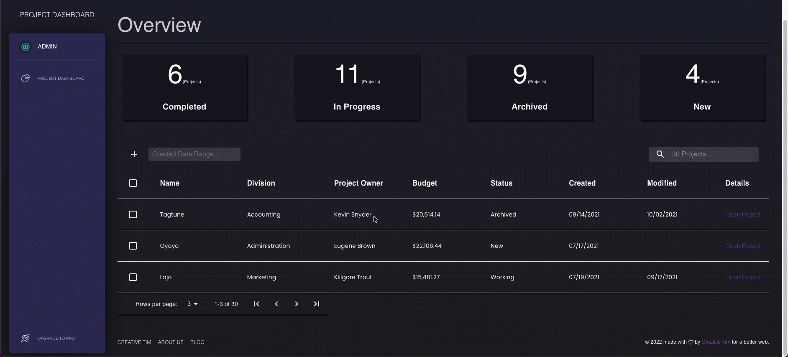

# Project Dashboard




## Overview
Project Dasboard is a client-side application built with [React](https://reactjs.org/) The application allows for a user to manage project related data. The dashboard uses the **Black Dashboard Theme** designed by [Creative Tim](https://www.creative-tim.com/) and is equipped with filtering, sorting, and editing capabilities for management purposes. [See Demo](http://meddy672-project-dashboard.s3-website-us-east-1.amazonaws.com)

## Features
- Search Filter
- Range Filter (On Created Date)
- Column Sorting
- Edit Project
- Add Project (Disabled Feature)

## Local Setup
Node.js (Required)

To set up the project locally, simply clone repository and run the following commands:
```bash
git clone https://github.com/meddy672/Project-Dashboard.git
```
Next, `cd` in the project and run the following commands:
```bash
npm start && npm start
```

The application will be available at: [http://localhost:3000/admin/dashboard](http://localhost:3000/admin/dashboard)